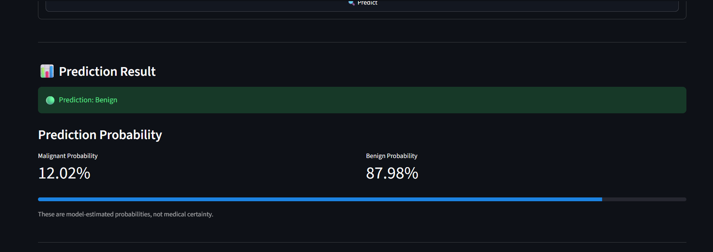
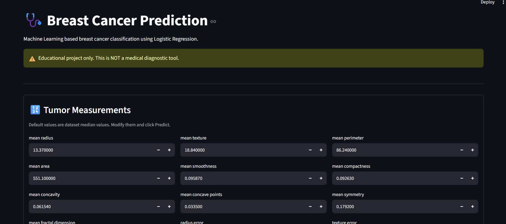
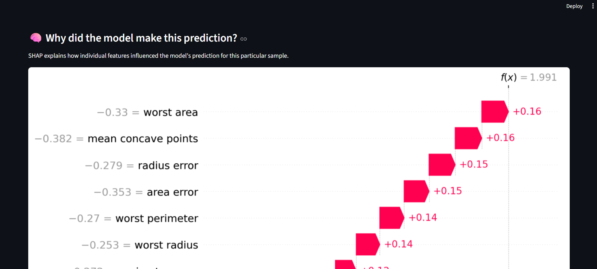

# 🩺 Breast Cancer Prediction

A machine learning-powered web application for breast cancer classification using Logistic Regression and explainable AI with SHAP values.


## ⚠️ Disclaimer

**This is an educational project only and is NOT a medical diagnostic tool.** This application should not be used for actual medical diagnosis or treatment decisions. Always consult qualified healthcare professionals for medical advice.

## 📋 Overview

This project demonstrates the application of machine learning in healthcare by building a breast cancer classifier. The model uses tumor measurements to predict whether a tumor is malignant or benign, with visual explanations powered by SHAP (SHapley Additive exPlanations).

## ✨ Features

- **Interactive Web Interface**: Built with Streamlit for easy user interaction
- **Machine Learning Prediction**: Logistic Regression model trained on the Wisconsin Breast Cancer Dataset
- **Probability Scores**: Displays confidence levels for predictions
- **Explainable AI**: SHAP waterfall plots show feature importance for individual predictions
- **User-Friendly**: Pre-filled with median values, customizable for different scenarios

## 📸 Screenshots

### Main Interface - Tumor Measurements Input

*Interactive input form with 30 tumor measurement features*

### Prediction Results

*Model prediction with probability scores showing malignant vs benign classification*

### SHAP Explanation

*SHAP waterfall plot explaining feature contributions to the prediction*

## 🚀 Getting Started

### Prerequisites

- Python 3.8 or higher
- pip package manager

### Installation

1. Clone the repository:
```bash
git clone https://github.com/vc74/Breast-Cancer-analysis.git
cd Breast-Cancer-analysis
```

2. Install required dependencies:
```bash
pip install streamlit joblib pandas matplotlib shap scikit-learn
```

### Running the Application

Start the Streamlit app:
```bash
streamlit run app.py
```

The application will open in your default web browser at `http://localhost:8501`

## 📊 How It Works

1. **Input Features**: The app accepts 30 tumor measurements (features from the Wisconsin Breast Cancer Dataset)
2. **Preprocessing**: Input data is scaled using the same scaler used during model training
3. **Prediction**: The Logistic Regression model predicts whether the tumor is malignant or benign
4. **Probability**: Shows the confidence level of the prediction
5. **Explanation**: SHAP values explain which features contributed most to the prediction

## 🧮 Model Details

- **Algorithm**: Logistic Regression with Standard Scaling
- **Dataset**: Wisconsin Breast Cancer Dataset (from scikit-learn)
- **Features**: 30 numerical features computed from digitized images of fine needle aspirate (FNA) of breast mass
- **Classes**: 
  - 0: Malignant (cancerous)
  - 1: Benign (non-cancerous)

## 📁 Project Structure

```
breast-cancer/
│
├── app.py                      # Main Streamlit application
├── breast_cancer.ipynb         # Jupyter notebook (training/analysis)
├── breast_cancer_model.pkl     # Trained model file
└── README.md                   # Project documentation
```

## 🛠️ Technologies Used

- **Python**: Programming language
- **Streamlit**: Web application framework
- **scikit-learn**: Machine learning library
- **SHAP**: Model interpretability library
- **pandas**: Data manipulation
- **matplotlib**: Visualization
- **joblib**: Model serialization

## 📈 Features List

The model uses the following 30 features derived from tumor cell nuclei characteristics:

- Mean, standard error, and "worst" (mean of the three largest values) for:
  - Radius
  - Texture
  - Perimeter
  - Area
  - Smoothness
  - Compactness
  - Concavity
  - Concave points
  - Symmetry
  - Fractal dimension

## 🤝 Contributing

Contributions are welcome! Please feel free to submit a Pull Request.

## 📝 License

This project is open source and available under the [MIT License](LICENSE).

## 👤 Author

**vc74**

- GitHub: [@vc74](https://github.com/vc74)

## 🙏 Acknowledgments

- Wisconsin Breast Cancer Dataset from UCI Machine Learning Repository
- scikit-learn for providing easy access to the dataset
- SHAP library for explainable AI capabilities
- Streamlit for the amazing web framework

## 📞 Contact

For questions or feedback, please open an issue on this repository.

---

**Remember**: This tool is for educational purposes only. Always seek professional medical advice for health concerns.
